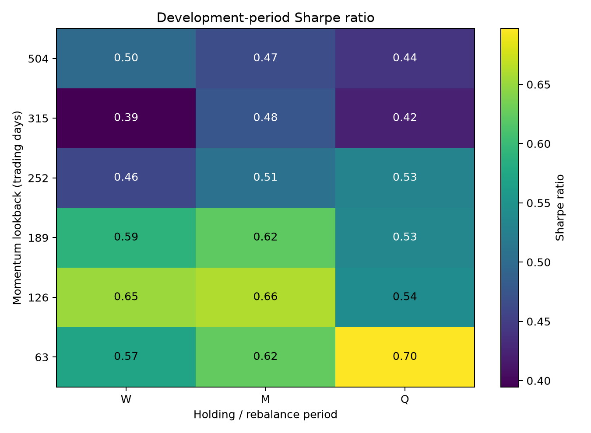
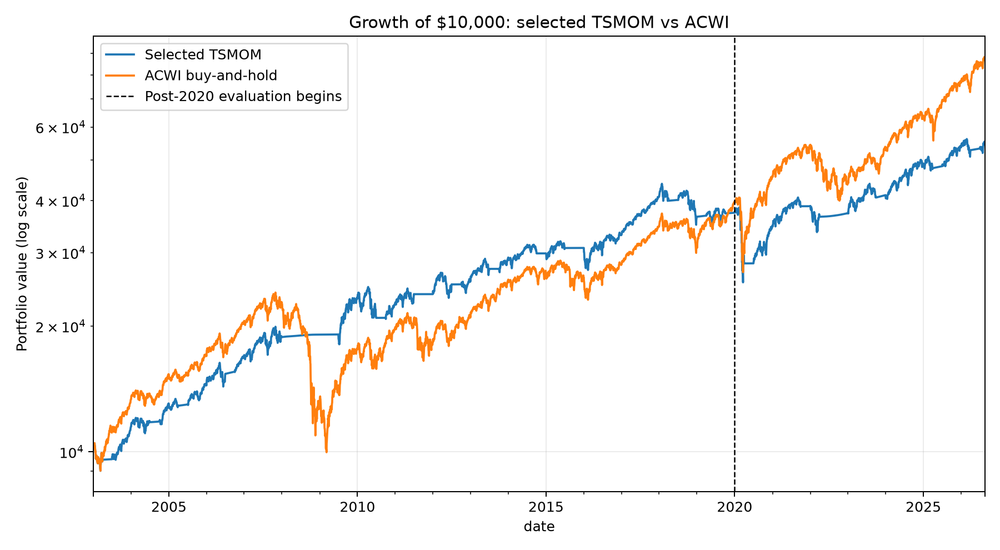
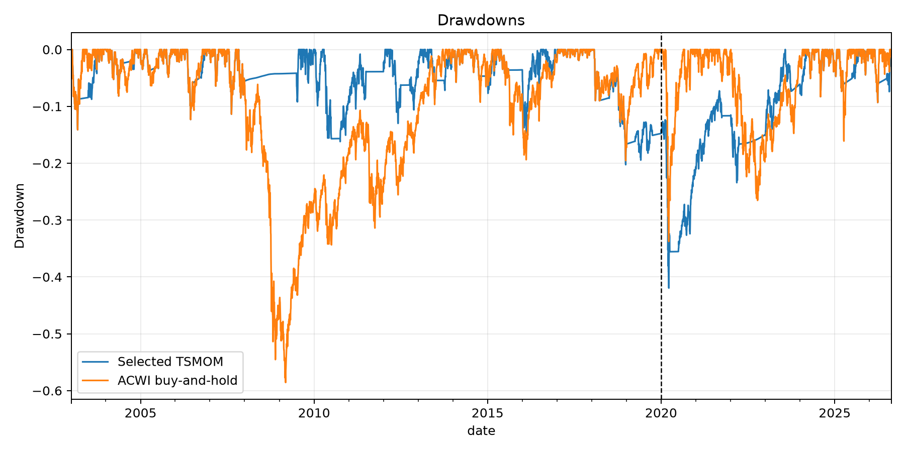

# MSCI ACWI Time-Series Momentum

## Research question

**Does time-series momentum work on MSCI ACWI, and how does performance vary across momentum lookbacks and holding/rebalancing periods?**

This project tests a long/cash absolute-momentum rule across 18 parameter combinations rather than presenting one hand-picked strategy. The full grid is evaluated before 2020, one specification is selected on development-period Sharpe ratio, and that specification is then frozen for a post-2020 evaluation.

## Project evolution

[`initial_research_prototype.py`](initial_research_prototype.py) is the original notebook-style idea behind the project. It was written manually as a learning exercise to work through data collection, a single 252-day momentum signal, the long/cash allocation, implementation costs, and basic performance statistics in a direct sequence.

AI assistance was later used to review and refine the implementation, expand the single-rule prototype into a transparent parameter study, improve the treatment of data alignment and execution timing, simplify the repository structure, and edit the documentation. The final research design, assumptions, interpretation, and responsibility for the conclusions remain with the author. The prototype is retained to make that development process visible; all reported portfolio results come from [`tsmom_backtest.py`](tsmom_backtest.py).

## Local data setup

Source CSVs are stored locally in `data/raw/` and excluded from Git. The main script selects the latest filename matching each pattern:

| Required file pattern | Series used | Required columns |
| :--- | :--- | :--- |
| `msci_acwi_grtr_*.csv` | MSCI ACWI, USD, Gross Total Return | `DATE`, `LEVEL` |
| `msci_acwi_netr_*.csv` | MSCI ACWI, USD, Net Total Return | `DATE`, `LEVEL` |
| `fred_dgs3mo_*.csv` | FRED DGS3MO | `observation_date`, `DGS3MO` |

The MSCI series are for [MSCI ACWI index code 892400](https://www.msci.com/indexes/index/892400/msci-acwi-index). Obtain the gross and net variants through an MSCI download or data service covered by your license. MSCI data must not be committed or redistributed without the necessary permission. The cash series can be downloaded from [FRED DGS3MO](https://fred.stlouisfed.org/series/DGS3MO); FRED identifies it as public-domain data with citation requested.

[`initial_research_prototype.py`](initial_research_prototype.py) contains the original live-download workflow. When run with authorized MSCI access, it now saves all three snapshots under the filename patterns above. Alternatively, download the files manually and place them in `data/raw/`.

## Methodology

The signal is positive when the MSCI ACWI Gross Total Return Index is above its level `lookback` trading days earlier:

```text
positive trailing return  ->  100% ACWI
negative trailing return  ->  100% cash
```

Signals are refreshed at the last available observation of each week, month, or quarter. The parameter grid is deliberately small and economically interpretable:

```python
LOOKBACKS = [63, 126, 189, 252, 315, 504]
HOLDINGS = ["W", "M", "Q"]
```

All candidates share a common evaluation start of 2003-01-02, after the 504-day lookback has reached its first quarterly decision and the execution lag has passed. Observations through 2019-12-31 form the development period. The highest-Sharpe specification is selected; turnover and drawdown are reported alongside Sharpe to show the economic trade-offs.

The selected parameters are not changed using data from 2020 onward. This later sample is called the **post-2020 evaluation period**, not a pristine untouched holdout, because the broader research methodology has evolved after earlier results were observed.

## Data and execution assumptions

- MSCI ACWI Gross Total Return levels generate momentum signals.
- MSCI ACWI Net Total Return levels provide realized equity-return proxies.
- FRED DGS3MO is the cash-rate proxy.
- Treasury yields are aligned backward to ACWI dates; future rates are never backfilled.
- The yield known at the preceding close accrues over the actual calendar days between observations.
- A signal observed at close `t` is assumed traded at close `t+1`; the new allocation first affects the return ending at close `t+2`.
- Transaction costs are 5 bps per unit of turnover.
- A 0.32% annual ETF expense is charged only while invested in equity.
- The portfolio is always either 100% ACWI or 100% cash.

The cached common sample contains 6,690 observations from 2000-12-29 through 2026-08-20.

## Parameter results

The development-period results are broadest among the shorter and intermediate lookbacks. The 63-, 126-, and 189-day variants generally produced higher Sharpe ratios than the 252- to 504-day variants. The optimum is therefore not the only profitable cell, although performance weakens as lookbacks lengthen.



The complete ranked grid, including CAGR, volatility, Sharpe, maximum drawdown, ending wealth, turnover, and position changes, is available in [`results/development_results.csv`](results/development_results.csv).

## Selected specification

| Lookback | Rebalance period | Development CAGR | Volatility | Sharpe | Maximum drawdown | Turnover |
| ---: | :---: | ---: | ---: | ---: | ---: | ---: |
| 63 trading days | Quarterly | 8.07% | 9.64% | 0.70 | -20.26% | 28.0 |

The selected rule improved development-period risk-adjusted performance and drawdown relative to buy-and-hold, despite producing a slightly lower CAGR.

## Selected strategy vs buy-and-hold

| Period | Strategy | CAGR | Volatility | Sharpe | Maximum drawdown | Ending wealth |
| :--- | :--- | ---: | ---: | ---: | ---: | ---: |
| Development | Selected TSMOM | 8.07% | 9.64% | 0.70 | -20.26% | $37,393 |
| Development | ACWI buy-and-hold | 8.43% | 14.94% | 0.51 | -58.57% | $39,545 |
| Post-2020 evaluation | Selected TSMOM | 5.85% | 12.77% | 0.28 | -33.76% | $14,584 |
| Post-2020 evaluation | ACWI buy-and-hold | 12.62% | 16.19% | 0.62 | -33.76% | $21,997 |
| Full sample | Selected TSMOM | 7.44% | 10.61% | 0.55 | -41.96% | $54,535 |
| Full sample | ACWI buy-and-hold | 9.59% | 15.30% | 0.55 | -58.57% | $86,985 |

The development result supports a time-series momentum effect through lower volatility and shallower drawdowns. The result was not stable after 2020: the frozen strategy lagged buy-and-hold substantially and did not avoid the 2020 selloff. Across the full usable sample, TSMOM delivered a similar Sharpe ratio and a smaller maximum drawdown, but lower absolute wealth.





The exact comparison table is in [`results/period_comparison.csv`](results/period_comparison.csv), and the frozen parameters are in [`results/selected_strategy.csv`](results/selected_strategy.csv).

## Limitations

- MSCI index levels are not directly tradable; net index returns are an implementation proxy rather than ETF fills.
- The cash calculation assumes the DGS3MO yield can be earned without a spread or trading friction.
- The study tests one market and 18 related specifications, so the development winner still benefits from parameter selection.
- No leverage, short positions, taxes, market impact, or intraday execution uncertainty are modeled.
- Index history may include back-calculated periods and should not be interpreted as live fund performance.
- The post-2020 period is an honest frozen-parameter evaluation in this script, but it is not presented as a first-ever unseen result.

## How to run

```bash
python3 -m venv .venv
source .venv/bin/activate
pip install -r requirements.txt
python tsmom_backtest.py
```

The script reads the local source CSVs in `data/raw/`, prints the parameter and period tables, and recreates the six files in `results/`.

The initial prototype can also be run separately with:

```bash
python initial_research_prototype.py
```

Unlike the main study, the prototype requests current MSCI and FRED data and therefore requires an internet connection.
